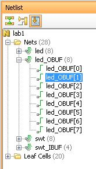

# 实验一 Vivado 设计流程

## 实验简介

本实验指导你使用 Vivado EDA 工具创建针对 Nexys4 DDR FPGA 开发板的简单 Verilog HDL 设计，在默认设置下进行仿真、综合和实现该设计。最终生成比特流文件，并将其下载到硬件中进行设计的功
能性验证。

## 实验目的

完成本实验后，你将能够：

    1. 创建一个以 Verilog HDL 模型为源文件，针对位于 Nexys4 DDR 板上的特定 FPGA 器件的 Vivado 工程；
    2. 使用提供的 Xilinx 设计约束文件（XDC 文件）约束某些引脚位置；
    3. 使用 Vivado 仿真器进行设计仿真；
    4. 综合和实现设计；
    5. 生成比特流文件；
    6. 利用产生的比特流文件配置 FPGA 并进行功能验证。

## 实验内容

本实验分为若干步骤，包括一般的概述说明，提供需遵循的详细指导的信息。按照这些详细的指示完成本实验。

## 设计描述

本设计的一些输入（sw4~sw7）直接连到对应的输出去控制 LED，其他的输入通过逻辑操作后输出控制剩余的 LED，如图下图所示。

## 一般流程

    1. 使用 IDE 创建一个 Vivado 项目，分析 Verilog HDL 源文件
    2. 使用 Vivado 仿真器进行功能仿真；
    3. 综合该设计，即将 Verilog HDL 程序编译成由基本逻辑单元组成的标准门级结构网表；
    4. 实现该设计，即将综合生成的逻辑网表配置到具体的 FPGA 芯片上；
    5. 时序仿真；
    6. 在硬件上进行功能验证。

## 实验步骤

**注：** 下面的实验步骤以 Vivado 2015.2 版本为依据，其它版本的 Vivado 操作方式类似！

### 步骤 1 使用 IDE 创建一个 Vivado 工程

**1-1. 启动 Vivado，使用 Verilog HDL 创建一个针对 XC7A100TCSG324C-1 器件（Nexys4 ）的项目，使用提供的 lab1.v 和 lab1.xdc 文件。**

1-1-1. 打开 **vivado 2015.2**

1-1-2. 点击 **Create New Project**（创建新项目）启动向导。你将看到创建一个新 Vivado 项目的对话框，点击 **Next**。

1-1-3. 在 *Project location* 框中输入项目目录，或者点击右侧的浏览按钮选择路径。

1-1-4. 在 *Project name* 框中输入项目名（如 lab1），在 *Create Project Subdirectory*（创建项目子目录）选项上打上勾，点击 **Next**。

1-1-5. 在工程类型表中选择 **RTL Project** 选项，点击 **Next**。

1-1-6. 现在进入到 *Add Sources* 窗口，使用下拉按钮选择 Verilog 作为目标语言和仿真语言。

1-1-7. 点击绿色的加号按钮，选 *Add Files* 来添加设计文件，在打开的窗口中浏览到 lab1.v 所在的路径，选择 lab1.v，点击 **OK**，然后点击 **Next** ，进入 *Add Existing IP*（添加已有 IP） 窗口。

1-1-8. 由于没有任何 IP 需要添加，直接点击 **Next** 跳过，进入 *Add Constraints*（添加约束）窗口。

1-1-9. 在 *Add Constraints* 窗口中点击加号按钮和 *Add Files* 添加约束文件，在打开的窗口中进入到lab1.xdc 所在的目录，选择 lab1.xdc，点击 **OK**，再点击 **Next**。

约束文件是将 FPGA 上的物理 I/O 口分配给板上拨码开关和 LED 等 I/O 设备。板上 I/O 引脚位置信息可以通过开发板的原理图或开发板的用户手册获得，Nexys4 DDR 开发板请参见文档 nexys4ddr_rm 第 18 页图 16。

1-1-10. 在 *Default Part* 窗口中，使用 **Parts** 选项和各种下拉 **Filter** 项进行过滤，选择XC7A100TCSG324-1 作为下载对象，如图下图所示，点击 **Next**。

1-1-11. 点击 **Finish** 创建此 Vivado 项目。

使用 windows 资源管理器查看该项目路径，你将会找到 lab1.cache 和 lab1.srcs 目录，且项目文件 lab1.xpr 已被创建。lab1.cache 目录是一个 Vivado 程序数据库的缓存位置，另外两个目录 constrs_1 和 sources_1 被创建在 lab1.srcs 目录下，再往下 lab1.xdc 约束文件和 lab1.v源文件的副本对应在其中。

**1-2．打开 lab1.v 源文件并分析其内容**

1-2-1. 在 *Sources*（资源）窗格中，双击 lab1.v 打开该文件。

1-2-2. Verilog 代码的第一行是仿真器的时间尺度指令 timescale，它定义了时延的单位和精度。2-5 行是注释，用于描述模块名和模块的目的。

1-2-3． 第7行定义模块开头（以关键字module标记），第19行定义结尾（以关键字endmodule标记）。

1-2-4. 8-9 行定义输入和输出端口，12-17 行定义模块的实际功能。

**1-3. 打开 lab1.xdc 约束文件并分析其内容。**

1-3-1. 在 *Sources*（资源）窗格中展开 *Constraints* （约束）文件夹并双击 lab1.xdc 打开该文件。

1-3-2. 13-20 行定义了输入开关[7:0]的引脚位置，33-40 行定义了输出 LED[7:0]的位置。

**例如：** 第 13 行定义将设计电路的端口 swt[0]分配给板上引脚 J15（即拨码开关 sw0），这样，可以通过开关输入信号给所设计的电路，观察 LED 灯的输出来验证其功能的正确性。

**1-4. 在源文件基础上运行 RTL 分析**

1-4-1. 在左侧的 *Flow Navigator*（流程导航器）中，展开 *RTL Analysis*（RTL 分析）任务下 *Elaborated Design*（详细的设计）条目，点击 **Schematic**（原理图）。

此时 Vivado 将对该设计模块进行设计分析，并显示一个设计的逻辑视图。

**注意：** 一些开关输入在输出到 LED 前连接到了门，其他输入直接连到了 LED 上，和设计文件中的 lab1 模块描述一致。

### 步骤 2 使用 Vivado 仿真器进行仿真

**2-1. 添加测试文件 lab1_tb.v**

2-1-1. 在 *Flow Navigator* 的 *Project Manager**（项目管理）任务下点击 **Add Sources**（添加资源）。

2-1-2. 选择 *Add or Create Simulation Sources*（添加或者创建仿真资源）选项，点击 **Next**。

2-1-3. 在 *Add Sources* 窗口中点击和 **Add Files** 添加测试文件。

2-1-4. 在打开的窗口中浏览到 lab1_tb.v 所在的目录，选择 lab1_tb.v，点击 **OK**。

2-1-5. 点击 **Finish**。

2-1-6. 选择 *Sources*（资源）表项，展开 *Simulation Sources*（仿真资源）。

lab1_tb.v 文件被添加到 *Simulation Sources* 组下，lab1.v 自动放置在该层作为 dut (被测设备)实例。

2-1-7. 使用 Windows 资源管理器，检查 sim_1 目录被创建在 lab1.srcs 目录下，与 constrs_1 和 sources_1 目录同一级，且 lab1_tb.v 的一个副本被放置在 **lab1.srcs > sim_1 > imports >lab1** 下。

2-1-8．双击 **Sources** 窗格中的 lab1_tb 查看其内容。

此测试文件的第 1 行定义了仿真时间单位和精度。测试模块的定义从第 5 行开始。15行实例化了 DUT。17~26 行定义了与设计的模块功能相同的函数，用于产生供比较用的预期值。28~39 行定义了激励产生，并将预期值与 DU 提供的结果相对比。41 行结束测试。当仿真运行时，系统显示任务 $display 将信息输出到仿真器控制台窗口。

**2-2. 使用 Vivado 仿真器进行 200ns 的仿真**

2-2-1. 在 *Flow Navigator* 的 **Simulation** 任务下选择 **Simulation Settings**（仿真设置），将弹出一个显示仿真属性的 **Project Settings** 窗口。

2-2-2. 选择 **Simulation** 标签，在 **simulation runtime** (仿真运行时间) 中输入 200ns，点击 **OK**。

2-2-3. 在 *Flow Navigator* 的 **Simulation** 任 务 下 点 击 **Run Simulation > Run BehavioralSimulation**（运行仿真>运行行为仿真）。

测试文件和资源文件将会被编译，Vivado 仿真器运行（如果无误），仿真器输出结果如图所示。

你将看到四个主要视图：
    1）Scopes，测试层级和 glbl 实例将会被显示在其中；
    2）Objects，顶层信号将会被显示；
    3）波形窗口
    4）Tcl 控制台，仿真活动将会被显示。

**注意：** 使用的测试文件是自检的，仿真运行时结果将显示。lab1.sim 目录和几个更底层的目录被创建在 lab1 目录下。

你会看到波形窗口旁边的几个按钮，它们用于下表所列的一些特定目的。

2-2-4. 点击位于波形窗口左边的 *Zoom Fit*（缩放适合）按钮()，观察整个波形图。

你也可以点击视图右上角的浮动按钮（如图所示中间那个按钮）使波形图窗口浮动以便改变其位置，这将使你有个更加开阔的视窗观察仿真波形。只要点击停靠按钮（如图所示中间那个按钮）就可以重新将浮动窗口整合到 GUI。

**2-3. 按照需要改变显示格式**

2-3-1. 在波形窗口选择 i[31:0]，点击右键选择 Radix (基数)，然后选择 Unsigned Decimal（无符号十进制）以整数格式观察 for 循环的索引值。类似地，将 switchs[7:0]的基数改为 Hexadecimal（十六进制），保持 leds[7:0]和 e_led[7:0]的基数为 binary（二进制），因为我们需要观察每个输出位。

**2-4. 添加更多底层的信号到波形图中来观察它们的变化，继续仿真 500ns。**

2-4-1. 在 *Scopes* 窗口中展开 lab1_tb 实例（如果必要），选择 dut 实例，swt[7:0] 和 led[7:0] 信号将会显示在 *Objects* 窗口。

2-4-2. 选择 swt[7:0]和 led[7:0] 并将其拖到波形窗口以监视那些更底层的信号。

2-4-3. 在工具栏中将仿真运行时间改为 500，点击时间单位区的下拉按钮选中 ns（），点击按钮来继续仿真 500ns（共 700ns，因为前面已经仿真了 200ns）。

2-4-4. 点击 *Zoom Fit* 按钮观察输出。

观察 Tcl 控制台窗口，可以看到 $display 任务输出的结果如下图所示。

2-4-5. 选择菜单上的 **File > Close Simulation**（文件>关闭仿真）来结束仿真。

2-4-6. 点击 **OK**，又会弹出个窗口询问是否保存波形图，点击 **Discard** 不保存。

### 步骤 3 综合该设计

**3-1. 使用 Vivado 综合工具综合该设计并分析工程摘要输出。**

3-1-1．在 *Flow Navigator* 的 **Synthesis** 任务下点击 Run Synthesis（运行综合）。

综合进程将运行在 lab1.v 文件上（和所有同级文件，如果存在）。进程结束后，将弹出一个带有三个选项的 *Synthesis Completed*（综合完成）对话框。

3-1-2. 选择 *Open Synthesized Design*（打开被综合的设计）选项，点击 **OK**，因为我们想要在进行实现阶段前观察综合输出。如果有个对话框显示出来，就点击 **Yes** 以关闭详细设计。

**注：** 查看被综合的设计是一个可选项，如果不想看它，选择 **Run Implementation**（运行实现）直接跳到**步骤 4**。

3-1-3. 选择 **Project Summary**（工程摘要）标签（如果标签不可见，则选择菜单上的 **Layout > Default Layout** 将布局选为默认布局，或者点击 **Project Summary** 图标。

点击不同的链接观察它们都提供了什么信息以及哪些可以使你修改综合设置。

3-1-4. 在 **Project Summary** 中点击 **Table** 标签（如果 Table 标签不可见，则在 **Project Summary** 窗口中往下拉滚动条）

如下图所示，可以看到估计有三个 LUT 和 16 个 IO（8 个输入和 8 个输出）被用到。

3-1-5. 在 *Flow Navigator* 的 **Synthesis** 任务下，点击 **Schematic**（原理图）（如果不可见，需要展开 **Synthesized Design**），以原理图的视图观察综合后的设计。

**注意：** IBUF 和 OBUF 作为输入和输出缓冲被自动添加到设计中。逻辑门在 LUT 中实现（1 个输入作为 LUT1，2 个输入作为 LUT2，3 个输入作为 LUT3）。在综合输出中，RTL
分析输出中的 4 个门被映射到 4 个 LUT。

使用 Windows 资源管理器，验证 lab1.runs 目录被创建到 lab1 下。在 runs 目录下，包含几个临时子目录的 synth_1 目录被创建。

### 步骤 4 实现该设计
### 注: 进行该步骤前一定要确认顶层设计文件中的引脚已经与约束文件中的引脚完成绑定，即引脚名称完全一一对应！

**4-1. 利用 Vivado 默认设置实现该设计，并分析工程输出概要。**

4-1-1. 在 *Flow Navigator* 的 *Implementation* 任务下，点击 **Run Implementation**（运行实现）。

实现进程将在综合输出文件上运行。进程完成时将弹出一个带有三个选项的 *Implementation Completed*（实现完成）对话框。

4-1-2. 当我们需要以器件视图表的形式查看被实现的设计时，选择 **Open implemented design**（打开被实现的设计）并点击 **OK**。

**注：** 查看被实现的设计是一个可选项，如果不想看它，选择 **Generate Bitstream**（生成比特流）进入到**步骤 6**. 

4-1-3. 点击 **Yes** 关闭被综合的设计（如果有提示对话框显示出来）

被实现的设计将被打开。

4-1-4. 在 *Netlist* （网表）面板上，选择 nets 中的一个（如 led_OBUF[1]），该网络会显示在器件视图的 X1Y1 区域（你可能需要缩放以观察到它）。

4-1-5. 如果未选中，点击 *Routing Resources* 图标显示布线资源。

4-1-6. 关闭被实现的设计视图，选择 **Project Summary** 标签（你可能需要修改默认的布局，见 3-1-3）观察结果。

选择 **Post-Implementation** 标签。

**注意：** 实际利用的资源有 3 个 LUT 和 16 个 IO，且它表明本设计没有定义时间约束（因为本设计是组合形式的）。

使用 Windows 资源管理器，查看 impl_1 目录被创建在 lab1.runs 目录下与 synth_1 同一级。Impl_1 目录包含几个含有实现报告文件的文件。

4-1-7. 在底部选择 **Reports**（报告）标签（如不可见，选择菜单上的 **Window >Reports**)，并双击 *Place Design* 下的 *Utilization Report* (利用率报告)。在辅助视图面板中该报告将显示资源的利用情况。

**注意：** 由于是组合设计，未用到寄存器。

### 步骤 5 执行时序仿真

**5-1. 运行时序仿真**

5-1-1. 在 *Flow Navigator* 的 *Simulation* 任 务 下 ， 点 击 **Run Simulation > Run Post-Implementation Timing Simulation**（运行仿真>运行实现后时序仿真)。

利用被实现的设计，Vivado 仿真器将被启动，lab1_tb 作为顶层模块。

使用 Windows 资源管理器，检查 timing 目录被创建在 lab1.sim > sim_1 > impl 目录下。Timing 目录包含用来进行时序仿真的生成文件。

5-1-2. 点击 **Zoom Fit** 按钮观察 0~200ns 的波形。

5-1-3. 在 50ns（这儿开关输入置为 0000000b）处右键选择 **Markers > Add Marker**。

5-1-4. 类似的，在大约 55ns 的地方右键添加一个标记，这个位置 LEDs 改变。

5-1-5. 你也可以通过点击 **Add Marker** 按钮（）来添加标记。点击 **Add Marker** 按钮，在大约 60ns 处点击左键，这个位置 e_led 变化。

**注意：** 我们监测预期的 LED 输出在输入改变的 10ns 后（见 testbench），然而实际延时大约 5ns。

5-1-6. 通过选择菜单上的 **File > Close Simulation** 在不保存任何更改的前提下关闭仿真器。

### 步骤 6 生成比特流进行功能验证

**6-1．连接板子，上电。生成比特流，打开一个硬件会话，给 FPGA 编程。**

6-1-1. 确保 Micro-USB 电缆连接到 JTAG PROG 连接器（电源接头旁边）。

6-1-2. 确保开发板使用 USB 电源（电源选择跳帽 JP3）。

6-1-3. 板子上的电源打开，这时板卡会运行一个预装的演示程序，在 7 段数码管上不停地显示蛇形图案。

**注：** 有些开发板预装的演示程序被重置，因此也可能没有任何显示！

6-1.4. 在 *Flow Navigator* 的 *Program and Debug* 任务下，点击 **Generate Bitstream**（生成比特流）。

比特流生成过程将基于被实现的设计进行。处理结束，具有两个选项的 *Bitstream Generation Completed*（比特流生成完成）对话框将被弹出。

此过程将在 lab1.runs 路径的 impl_1 目录下生成一个 lab1.bit 文件。

6-1-5. 选择 *Open Hardware Manager*（打开硬件管理器）选项，点击 **OK**。

Hardware Manager（硬件管理器）窗口将被打开，显示处于 “unconnected” （未连接）状态。

6-1-6. 点击 **Open target**，然后选择 **Auto Connect**（如上图所示），可能需要等几秒钟让 vivado 连接 Nexys4 DDR 板上的目标 FPGA。

如果板子之前已经被选定为目标，你也可以点击打开最近的目标硬件链接。

6-1-7. 点击 **Program device** 然后选择 xc7a100t_0，对目标 FPGA 设备编程。

6-1-8. 接下来会弹出 **Program Device** 窗口，窗口中比特流文件 Bitstream file 框是自动填好的，如果没有的话就需手动选择。保留 Enable end of startup check 这项选择，点击 **Program**，用选择的比特流给 FPGA 编程。

编程下载的过程中会会出现一个窗口显示进度，当设备编程完毕，该窗口会自动关闭，完成指示灯亮。你可以看到 LED 灯按照开关状态显示。

6-1-9. 通过拨动开关验证功能并观察 LED 输出。

6-1.10. 满足要求，关闭开发板电源。

6-1-11. 选择 **File > Close Hardware Manager**（文件>关闭硬件管理器）来关闭硬件会话。

6-1-16. 点击 **OK** 关闭该会话。

6-1-17. 选择 **File > Exit** 并点击 **OK** 关闭 Vivado 程序。

## 实验总结

Vivado 软件工具能够用来执行一个完整的设计流程。使用提供的源文件（HDL 模块和用户约束文件）创建工程。行为仿真用来验证模块功能。然后模块进行综合，实现并生成一
个位流文件。使用相同的 testbench 在被实现的设计上进行时序仿真。使用生成的位流文件在硬件上进行功能性验证。